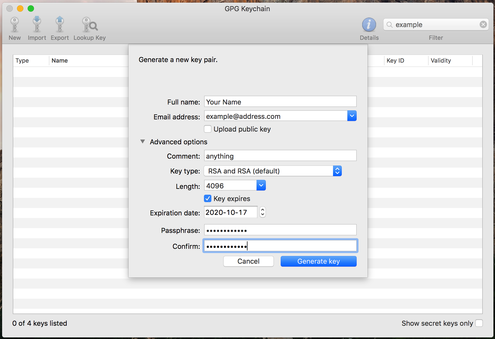
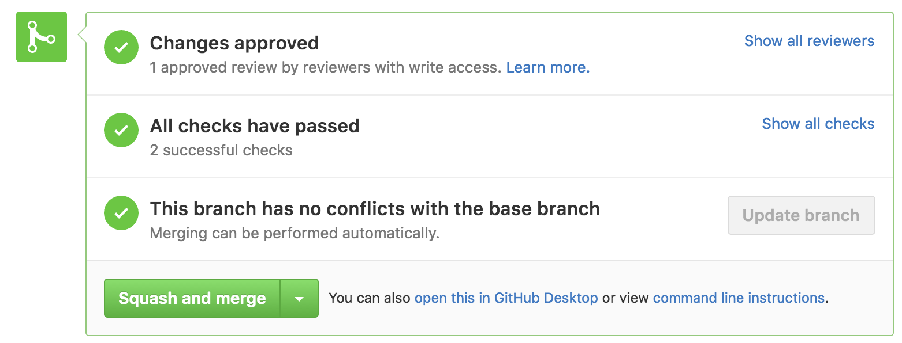

# Contributing

- [Setup Development Environment](#setup-development-environment)
- [Version Control](#version-control)
- [Your First Pull Request](#your-first-pull-request)

## Setup Development Environment

- [Git User](#git-user)
- [GPG Keys](#gpg-keys)

### Git User

1\. Tell Git who you are

```
> git config --global user.name "Your Name"
> git config --global user.email "example@address.com"
```

### GPG Keys

1\. Install [GPG Tools](https://gpgtools.org) -- do a customized install and deselect GPGMail.

2\. Tell Git to use the `gpg2` that comes with `GPG Tools`

```
> git config --global gpg.program /usr/local/MacGPG2/bin/gpg2
```

3\. Generate a GPG key using `Applications/GPG Keychain`



4\. Tell Git to use your new GPG Key and auto-sign all commits

```
> git config --global user.signingkey KEY_ID_FROM_STEP_3
> git config --global commit.gpgsign true
```

5\. Add Keys to Github

https://help.github.com/articles/adding-a-new-gpg-key-to-your-github-account/

https://help.github.com/articles/generating-a-new-gpg-key/

## Version Control

- [Master](#master)
- [Next](#next)
- [Branches](#branches)
- [Commits](#commits)
- [Code Review](#code-review)

### Master

The `master` branch should be considered the most up-to-date stable version of the software. No active development should take place on directly `master` and the latest commit should always be tagged to a release.

- [Hotfix](#hotfix) should be branched off of `master`

### Next

The `next` branch should be considered the most up-to-date development version of the software. No active development should take place on directly on `next`.

- All [development](#branches) should be branched off of `next`

- `next` should be rebased with `master` after a hotfix

### Branches

All development should happen on a branch off of `next`. Branch names should include a ticket number if possible: `TICKET-##-couple-words` or `my-update`.

```
❯ git checkout -b TICKET-11-my-feature
```

- Branches should be rebased with `next` if they get out of date.

- Branches should be [merged](#merge-branch) into `next` when they are completed.

### Hotfix

A hotfix is a [branch](#branches) that uses `master` as a base instead of `next`.

### Commits

- Commit messages should make it easy for some one to scan through a commit log and understand the current state of the code.
- When only changing documentation, include `[ci skip]` in the commit description
- Consider starting the commit message with an applicable emoji:
  * :tada: `:tada:` for the initial commit
  * :green_heart: `:green_heart:` when fixing the CI build
  * :white_check_mark: `:white_check_mark:` when adding tests
  * :arrow_up: `:arrow_up:` when upgrading dependencies
  * :arrow_down: `:arrow_down:` when downgrading dependencies
  * :shirt: `:shirt:` when removing linter warnings
  * :recycle: `:wrench:` when refactoring
  * :wrench: `:wrench:` when updating tooling

  start with one of the following emojis to add your commit to the change log:
  * :racehorse: `:racehorse:` when improving performance
  * :sparkles: `:sparkles:` when adding a new feature
  * :bug: `:bug:` when fixing a bug
  * :books: `:books:` when adding documentation
  * :globe_with_meridians: `:globe_with_meridians:` when adding internationalization

- you can use multiple emojis but only with first will be considered when generating the change log

#### Examples

Commits have the following structure:

```
:icon: [TICKET-1,TICKET-2] one line description

Longer description
- list of changes
- one more thing
```

Examples of valid commits:

```
:sparkles: [TICKET-1,TICKET-2] adds new page to that page

Adds new feature to do that thing that we wanted to do:
- That one thing it does
- that other thing it does
```

```
:bug: [TICKET-1] fixes bug with thing
```

```
:racehorse::wrench: better production mode
```

```
:shirt: fixes eslint in tests
```

### Code Review

- All branches should be pushed to Github for code review.

- All branches need to be reviewed and signed-off before they can be considered complete.

- Any branches containing significant changes will also need to be QA'ed.

### Merge Branch

After a branch has been [reviewed](#code-review) it can be merged.

When merging use the `Squash and Merge` option:



Before merging you are free to squash commits locally if you want more control over the commit message.

https://git-scm.com/book/en/v2/Git-Tools-Rewriting-History#Squashing-Commits

https://github.com/blog/2141-squash-your-commits

## Your First Pull Request
0. clone the repo
0. create a new [branch](#branches)
0. do some [work](#setup-development-environment)
0. [commit](#commits) your changes
0. push changes to Github for [review](#code-review)
0. repeat as necessary
0. rebase [next](#next) into your branch and deal with any conflicts.
0. get someone to [review and sign-off](#code-review) on your branch
0. wait for the CI system to test your branch
0. [merge](#merge-branch) into [next](#next)
